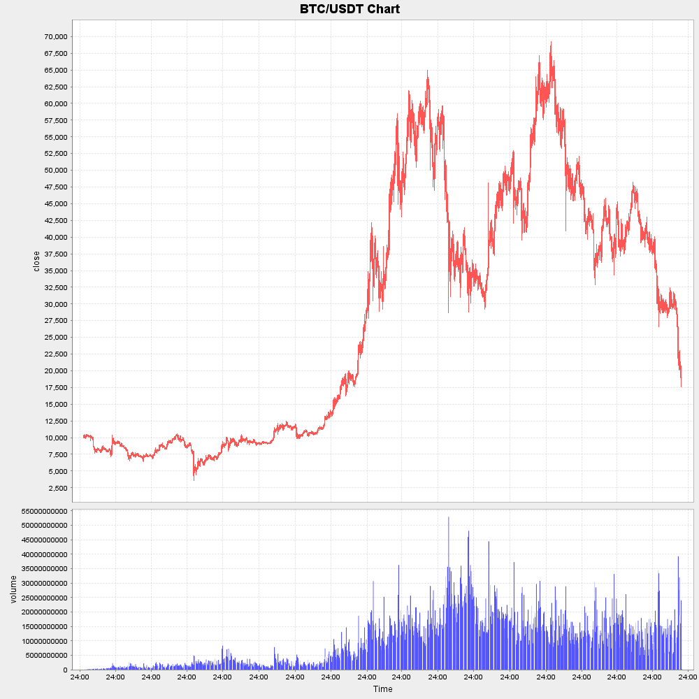

# Ödev 3

Bu haftaki ödevinizde aşağıdaki görevi tamamlamanızı bekliyoruz.

## Görev

### Açıklama

Bir finansal yatırım firmasında veri mühendisi olarak çalışıyorsunuz. Sizden kripto-para piyasaları ile ilgili bir veri ambarı oluşturma görevini verdiler. İşin başında olduğunuz için nasıl bir veri ile karşılacağınızı bilmiyorsunuz. Bu nedenle https://www.cryptodatadownload.com/ adresine gidip popüler kripto-para birimi Bitcoin'in günlük verisini indiriyorsunuz (`{root}/src/main/resources/Binance_BTCUSDT_d.csv`). İndirdiğiniz CSV dosyasını açtığınızda kolonlara sahip karşınıza bir veri seti olduğunu görüyorsunuz. Kolon isimleri baktığınızda pek anlam veremediniz ama sonrasında ekip arkadaşlarınızdan biri size bir ipucu verdiğinde bu verinin Bitcoin'in günlük mum(Candlestick/Klines) verisi olduğunu öğreniyorsunuz.

Veriyi daha anlaşılır hale getirmek için bir mum grafiği çıkarmaya karar verdiniz.

### Yapılacaklar

- `CryptoDataCSVRepository` sınıfında `readCSV(String filename)` içerisini tamamlamanızı bekliyoruz.
- `ChartService` sınıfında `createChartFromCryptoData()` metodunun içerisini doldurmanızı bekliyoruz.
- `TimeUtils` sınıfında `convertToDate(long millis)` metodunun içerisini doldurmanızı bekliyoruz.

### Uygulama Çıktısı

`Yapılacaklar` kısmını düzgün tamamlayıp `DrawGraphicApplication` çalıştırdığınızda, proje klasöründe `result.png` adında bir dosya oluşacaktır. Burada oluşan grafiği görebileceksiniz.

### ÖNEMLİ UYARILAR

- `Yapılacaklar` kısmı dışında yeni eklemeler hiçbir şekilde kabul **EDİLMEYECEKTİR**.
- `Yapılacaklar` kısmında belirtilen yerler dışında repo'da başka kısımlarında değişiklik **YAPMAMALISINIZ**. Aksi takdirde ödevinizi **TAMAMLAYAMAZSINIZ**.

## Anahtar Kelimeler

Java Charting, Candlestick, CSV Reader.

Kolaylıklar diliyorum.
